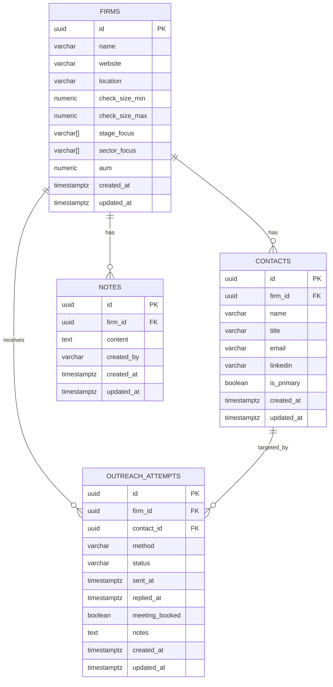

# ERD: VC Outreach CRM Database Schema

## Mermaid Diagram



## ASCII ERD

```
┌─────────────────────────────────────────────────────────────────────────┐
│                                FIRMS                                    │
├─────────────────────────────────────────────────────────────────────────┤
│ PK │ id                │ uuid           │ UUID primary key              │
│    │ name              │ varchar(255)   │ Firm name                     │
│    │ website           │ varchar(512)   │ Website URL                   │
│    │ location          │ varchar(255)   │ Office location               │
│    │ check_size_min    │ numeric(15,2)  │ Min check size (USD)          │
│    │ check_size_max    │ numeric(15,2)  │ Max check size (USD)          │
│    │ stage_focus       │ varchar[]      │ Investment stages             │
│    │ sector_focus      │ varchar[]      │ Sectors of interest           │
│    │ aum               │ numeric(15,2)  │ Assets under management       │
│    │ created_at        │ timestamptz    │ Creation timestamp            │
│    │ updated_at        │ timestamptz    │ Last update timestamp         │
└─────────────────────────────────────────────────────────────────────────┘
                                    │
           ┌────────────────────────┼────────────────────────┐
           │                        │                        │
           ▼                        ▼                        ▼
┌─────────────────────┐  ┌─────────────────────────┐  ┌─────────────┐
│      CONTACTS       │  │   OUTREACH_ATTEMPTS     │  │    NOTES    │
├─────────────────────┤  ├─────────────────────────┤  ├─────────────┤
│ PK │ id             │  │ PK │ id                 │  │ PK │ id     │
│ FK │ firm_id        │  │ FK │ firm_id            │  │ FK │ firm_id│
│    │ name           │  │ FK │ contact_id         │  │    │ content│
│    │ title          │  │    │ method             │  │    │ created│
│    │ email          │  │    │ status             │  │    │ created│
│    │ linkedin       │  │    │ sent_at            │  │    │ updated│
│    │ is_primary     │  │    │ replied_at         │  └─────────────┘
│    │ created_at     │  │    │ meeting_booked     │
│    │ updated_at     │  │    │ notes              │
└─────────────────────┘  │    │ created_at         │
           │             │    │ updated_at         │
           │             └─────────────────────────┘
           │                         ▲
           └─────────────────────────┘
              (contact_id FK)
```

## Relationship Summary

| Parent | Child | Cardinality | On Delete | Description |
|--------|-------|-------------|-----------|-------------|
| firms | contacts | 1:N | CASCADE | Firm has many contacts |
| firms | outreach_attempts | 1:N | CASCADE | Firm receives many outreach attempts |
| firms | notes | 1:N | CASCADE | Firm has many notes |
| contacts | outreach_attempts | 1:N | SET NULL | Contact targeted by outreach |

## Constraints

- **Unique**: Only one primary contact per firm (`is_primary = TRUE`)
- **Check**: Outreach method must be one of: email, linkedin, twitter, warm_intro, phone, in_person, other
- **Check**: Outreach status must be one of: draft, sent, delivered, opened, replied, bounced, unsubscribed, no_response
