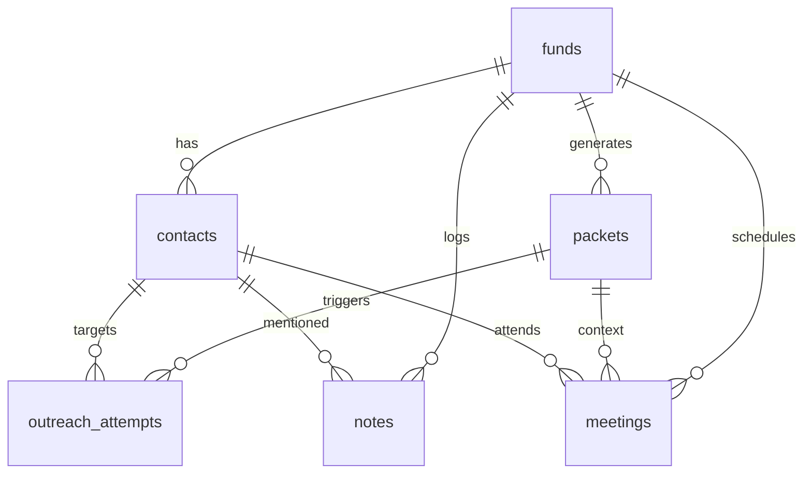

# CRM Data Layer ERD

## Entities & Notes
- **funds**: Source-of-truth for investor firms. Enforces unique names, stores stage/geo arrays, numeric check sizes, score & lifecycle status. `tags` JSONB keeps ingestion metadata without schema churn.
- **contacts**: Child entities for human operators. `is_primary` highlights default routing target.
- **packets**: Tie funds to Trello approvals and future outreach campaigns. Tracks priority snapshots to avoid recalculating mid-flow.
- **outreach_attempts**: Channel-specific history with immutable enums to keep reporting consistent.
- **meetings**: Links meetings back to packets or standalone fund interactions.
- **notes**: Internal/external visibility flag controls what can be surfaced to founders vs partners.
- **audit_log**: Append-only actions for compliance and future automation triggers.

## Integration Hooks
- FastAPI service will mount repositories over this schema using SQLAlchemy sessions from `app/db/session.py`.
- Trello automation consumes `packets`/`outreach_attempts` tables to sync statuses.
- Future ICP scoring updates `funds.score` and snapshot to packets for campaign-level context.
